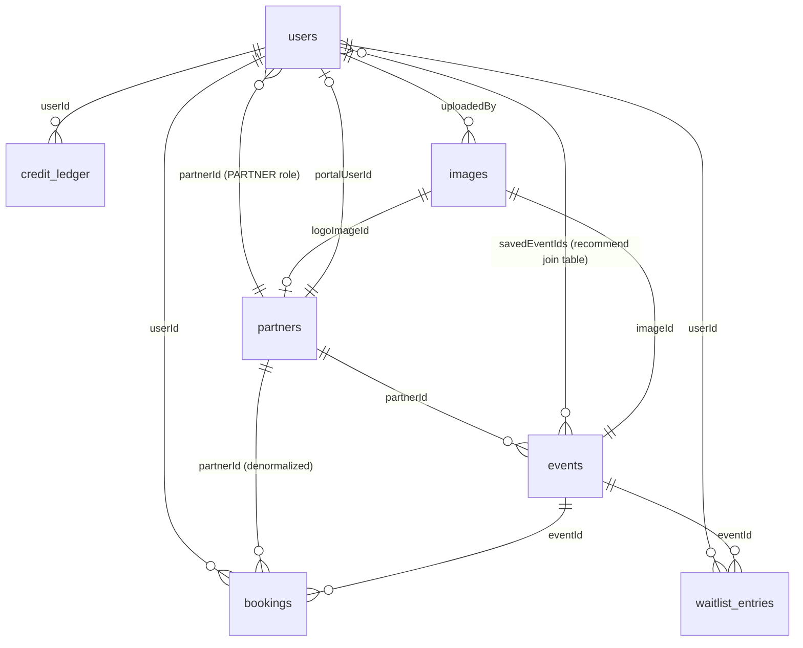

# Database Schema Overview (MVP — Drizzle ORM + Neon Postgres)

Complete production-MVP schema (including booking/credits/waitlist tables even if Phase 6–7 code is unshipped). Drizzle manages `public` only; Neon Auth owns `neon_auth`. Partner-portal / check-in **columns** may exist for forward compatibility but are labeled **post-MVP**.

## Entity overview

Tables: `users`, `subscriptions` (1:1), `saved_events`, `featured_events`, `partners`, `images`, `events`, `bookings`, `waitlist_entries`, `credit_ledger`.

---

### `users`

| Field | Type | Notes |
|---|---|---|
| `id` | text/uuid, PK | Was Firebase Auth UID; in the rewrite stores the **Better Auth user id** from Neon Auth (same value as `neon_auth.user.id`) — keyed in app code, not modeled as a Drizzle FK to `neon_auth` (see "Auth integration note" below) |
| `email` | text, unique | |
| `email_verified` | boolean | |
| `role` | enum: `USER`, `ADMIN`, `PARTNER` | MVP active roles: `USER`, `ADMIN`. `PARTNER` reserved for **post-MVP** portal |
| `credits` | integer | Non-negative constraint recommended |
| `partner_id` | text/uuid, FK → `partners.id`, nullable | Only for `PARTNER` role — **post-MVP** usage |
| `saved_event_ids` | — | **Use `saved_events` join table** (`user_id`, `event_id`) — not an array column |
| `created_at` / `updated_at` | timestamptz | Present in Firestore docs but not in the old TS types — add explicitly |

**`profile` (recommend: JSONB column `profile`, OR normalize if frequently queried):**

| Field | Type |
|---|---|
| `first_name`, `last_name` | text, nullable — set to `NULL`/anonymized placeholder on account deletion (see "Account deletion" below) |
| `age_group` | enum: `18-25`, `26-35`, `36-50`, `50+`, nullable |
| `interests`, `moods`, `districts`, `timing`, `preferred_days`, `preferred_languages` | text[] (Postgres native arrays are fine here — low cardinality, not relational) |
| `max_distance` | integer (km) |
| `accessibility` | boolean |
| `language` | enum: `DE`, `EN` |
| `onboarding_complete` | boolean |
| `deleted_at` | timestamptz, nullable | Set when account deletion (GDPR erasure) is processed — see below |

**Decided: newsletter fields dropped entirely.** The old app's `newsletterOptIn`/`newsletterStatus`/`newsletterToken`/`newsletterTokenExpires` fields had zero corresponding product (no signup UI, no sending logic) — carrying dead schema forward invites confusion. See `product/vision-and-domains.md` non-goals. If a newsletter is built later, add its schema then.

**Account deletion (GDPR right to erasure — new for the rewrite, see `features/auth.feature`):** on deletion, anonymize `email` (replace with a non-reversible placeholder unique value to preserve the unique constraint), null out `first_name`/`last_name` and all preference arrays, set `deleted_at`, and disable login (delete/ban the corresponding row in `neon_auth.user`, or clear its credentials — Neon Auth owns that table). **Do not hard-delete the `public.users` row** — `bookings` and `credit_ledger` rows retain their `user_id` foreign key for legally-required financial/accounting retention (German GoBD retention rules), so the `users` row must continue to exist in anonymized form rather than being deleted, which would either orphan those records or force cascading deletes that destroy required financial history.

**`subscription` (recommend its own 1:1 `subscriptions` table given it now integrates with real Stripe webhooks — easier to index/query independently of the `users` row than a JSONB blob):**

| Field | Type |
|---|---|
| `status` | enum: `ACTIVE`, `CANCELLED_PENDING`, `INACTIVE`, `PAST_DUE`, `UNPAID` — **`PAUSED` is decided-cut** (no feature ever used it; see `features/credits-subscription.feature`) |
| `period_end` | timestamptz, nullable |
| `plan` | enum/text, currently only `BASIC_BERLIN` |
| `stripe_customer_id`, `stripe_subscription_id` | text, nullable, unique where not null — **payment provider is decided: Stripe** (Stripe Billing: Checkout + Customer Portal + webhooks), see `extras/integrations-and-config.md` |
| `payment_method` | enum: `CARD`, `PAYPAL`, `SEPA`, nullable — informational display only; the actual charge/payment-method handling lives in Stripe, not in this app's database |
| `billing_address` | text, nullable |

**`behavior` analytics (recommend: JSONB column `behavior`, low query priority — this is write-heavy telemetry, not core business data):**

Counters (`session_count`, `event_open_count`, `booking_count`, `waitlist_count`, `saved_count`, `unsaved_count`, `filter_apply_count`), `view_counts` (map of view name → count), `recent_event_ids` (last 8), timestamps/last-touched fields (`last_seen_at`, `last_view`, `last_opened_event_id`, `last_booked_event_id`, `last_waitlisted_event_id`, `last_saved_event_id`, `onboarding_completed_at`, `preferences_updated_at`), and `last_filter` (category/partner/date-range/result-count/applied-at snapshot).
**Recommendation:** if real analytics/BI is planned (mentioned as future scope in the old migration plan), consider moving this to a proper event-log table instead of a mutable JSONB blob, so historical behavior isn't overwritten.

---

### `partners`

| Field | Type | Notes |
|---|---|---|
| `id` | text/uuid, PK | |
| `name` | text | |
| `address` | text | |
| `contact_email` | text | |
| `logo_image_id` | uuid, FK → `images.id`, nullable | **Was `logo_url` (text)** — replaced by a real image with generated size variants; see `extras/image-uploads.md`. Stays nullable/optional, matching today's optional logo |
| `venue_check_in_token` | text, unique, nullable | **Post-MVP** — QR self-check-in |
| `portal_user_id` | text/uuid, FK → `users.id`, nullable | **Post-MVP** — partner portal login |
| `portal_user_email` | text, nullable | **Post-MVP** — denormalized portal email |
| `created_at` / `updated_at` | timestamptz | |

---

### `images`

**Image pipeline** — see `extras/image-uploads.md`: S3-compatible storage, **six JPEG** variants per image (`original.jpg`, `hero-1920.jpg`, `large-1280.jpg`, `medium-640.jpg`, `small-320.jpg`, `og-1200x630.jpg`). Both `events.image_id` and `partners.logo_image_id` FK into this table.

| Field | Type | Notes |
|---|---|---|
| `id` | uuid, PK | Doubles as the storage key folder name — bucket layout is `images/{id}/{variant}.jpg` (six fixed filenames per id, see `extras/image-uploads.md` §1) |
| `original_width`, `original_height` | integer | Natural dimensions of the source file, before any resizing |
| `source` | enum: `UPLOAD`, `REMOTE_URL` | Which of the two entry paths produced this image (`extras/image-uploads.md` §3) |
| `source_url` | text, nullable | The original remote URL, only set when `source = REMOTE_URL` — kept for audit/re-processing, never used for direct display (the app always serves its own bucket copy) |
| `uploaded_by` | text/uuid, FK → `users.id`, nullable | Who triggered the upload/fetch (signed-in admin; partner uploads are **post-MVP**) |
| `created_at` | timestamptz | |

No per-variant rows or columns — the six filenames are a fixed, universal convention rather than stored data; a variant's URL is always computed as `{IMAGE_PUBLIC_BASE_URL}/images/{id}/{filename}` (`extras/image-uploads.md` §6).

**Deletion:** no legal retention requirement (unlike `bookings`/`credit_ledger`). When an event/partner's image is replaced, or the event/partner itself is deleted, delete the old `images` row and all six of its bucket objects in the same request — see `extras/image-uploads.md` §8.

---

### `events`

| Field | Type | Notes |
|---|---|---|
| `id` | text/uuid, PK | |
| `partner_id` | text/uuid, FK → `partners.id` | |
| `partner_name` | text | **Denormalized** from `partners.name` — kept in sync on partner rename in the old app. Recommend either (a) keeping the denormalization with an app-layer sync step, or (b) dropping it and always joining `partners` — Postgres makes the join cheap, so (b) is likely simpler now |
| `title`, `description`, `address`, `neighborhood` | text | |
| `image_id` | uuid, FK → `images.id`, **not nullable** | **Was `image_url` (text)** — replaced by a real image with generated size variants; see `extras/image-uploads.md`. Stays required, matching today's `image` field being non-optional on event create/edit (`features/admin-events.feature`) |
| `category`, `event_type` | text | Free-form strings today — consider enum/lookup table if the category list is meant to be fixed |
| `tags` | text[] | |
| `date_time` | timestamptz | |
| `timing_mode` | enum: `TIME_SLOT`, `ALL_DAY` | |
| `start_time_minutes` | integer (0–1439) | Derived/cached from `date_time` — recompute on write rather than trusting client input |
| `weekday` | integer (0–6) | Same — derived |
| `credit_price` | integer | |
| `total_capacity`, `remaining_capacity` | integer | `remaining_capacity` must never go negative — recommend a DB check constraint (`remaining_capacity >= 0`) in addition to app-layer transaction logic |
| `ticket_type` | enum: `VOUCHER`, `SECRET_CODE` | |
| `secret_code_mode` | enum: `MANUAL`, `SHARED_GENERATED`, `UNIQUE_PER_BOOKING`, nullable | |
| `secret_code` | text, nullable | Used for `MANUAL` and lazily-populated `SHARED_GENERATED` |
| ~~`voucher_template`, `secret_code_rules`~~ | — | **Decided cut:** present in the old type system but referenced by no scenario in any feature file and no current UI/business logic — dropped from the schema rather than carried forward as dead fields |
| `promo_code`, `event_website_url` | text, nullable | Required together when `ticket_type = VOUCHER` |
| `barrier_free` | boolean, nullable | |
| `languages` | text[], nullable | |
| `target_age_groups` | enum[], nullable | |
| `lat`, `lng` | numeric, nullable | |
| `created_at` / `updated_at` | timestamptz | |

---

### `saved_events`

Join table for member bookmarks (MVP).

| Field | Type | Notes |
|---|---|---|
| `user_id` | FK → `users.id` | Composite PK with `event_id` |
| `event_id` | FK → `events.id` | |
| `created_at` | timestamptz | |

Unique `(user_id, event_id)`. Cascade or restrict deletes per product rules (prefer remove save when event deleted).

---

### `featured_events`

Admin-curated Discover featured list (join table; no duplicated event payload).

| Field | Type | Notes |
|---|---|---|
| `event_id` | FK → `events.id`, PK | One featured row per event; **ON DELETE CASCADE** |
| `sort_order` | integer | Append on add; Discover/admin order by `sort_order` then `date_time` |
| `created_at` | timestamptz | |

Removing a featured row MUST NOT delete the underlying `events` row. Full Discover/browse product behavior is documented with the Featured Discover feature steps.

---

### `bookings`

| Field | Type | Notes |
|---|---|---|
| `id` | text/uuid, PK | Old app used a deterministic id `{userId}_{idempotencyKey}` for the atomic-booking path — in Postgres, prefer a real generated PK plus a **unique constraint on `(user_id, idempotency_key)`** to achieve the same idempotency guarantee more idiomatically |
| `user_id` | FK → `users.id` | |
| `event_id` | FK → `events.id` | |
| `partner_id` | FK → `partners.id` | **Denormalized** from `events.partner_id` — kept for fast partner-scoped guest-list queries. Worth keeping in Postgres too (or replace with an indexed join — measure query cost first) |
| `tickets_count` | integer | 1–3 in current UI, not enforced server-side beyond a client-side stepper — recommend enforcing 1–3 (or a configurable max) at the DB/app layer |
| `total_credits` | integer | Snapshot of price paid, independent of later price changes |
| `status` | enum: `CONFIRMED`, `WAITLIST`, `CANCELLED`, `USED` | |
| `redemption_type` | enum: `VOUCHER`, `SECRET_CODE`, nullable | |
| `redemption_info`, `redemption_url` | text, nullable | |
| `idempotency_key` | text | See PK note above |
| `checked_in_at` | timestamptz, nullable | **Post-MVP** active use (door check-in); column may exist for forward compatibility |
| `cancelled_at` | timestamptz, nullable | Set when an admin cancels a booking; distinct from `checked_in_at` |
| `cancellation_reason` | text, nullable | New — required whenever `status` is set to `CANCELLED` by an admin |
| `created_at` / `updated_at` | timestamptz | |

---

### `waitlist_entries`

| Field | Type | Notes |
|---|---|---|
| `id` | text/uuid, PK | |
| `event_id` | FK → `events.id` | |
| `user_id` | FK → `users.id` | |
| `requested_qty` | integer | |
| `status` | enum: `WAITING`, `PROMOTED`, `CANCELLED` | **Decided/resolved:** `PROMOTED` is now a real, produced status — automatic promotion is implemented (see `features/waitlist.feature`). `CANCELLED` is now also user-reachable (self-cancel), not just admin-only |
| `skipped_once` | boolean, default `false` | New — set when a promotion attempt skips this entry because the member was no longer eligible (subscription lapsed / insufficient credits) at the moment their turn came up; lets support distinguish "still waiting, never offered" from "was offered, couldn't take it" |
| `created_at` / `updated_at` | timestamptz | |

---

### `credit_ledger`

| Field | Type | Notes |
|---|---|---|
| `id` | text/uuid, PK | Old app used `book_{bookingId}` for booking-related entries |
| `user_id` | FK → `users.id` | |
| `amount` | integer | Positive (refill/adjust-up) or negative (booking spend/adjust-down) |
| `balance_after` | integer | Snapshot for audit trail |
| `type` | enum: `SUBSCRIPTION_REFILL`, `BOOKING`, `EXPIRY`, `REFUND`, `ADMIN_ADJUST` | **Decided, resolved from the old app's unused-enum-value gap:** `PURCHASE` and `REFERRAL_BONUS` are cut (no à la carte credit purchases or referral program — see `product/vision-and-domains.md` non-goals). `EXPIRY` and `REFUND` are now real, produced types — `EXPIRY` on every subscription renewal/cancellation-at-period-end (forfeiting unused credits, see `features/credits-subscription.feature`), `REFUND` on admin manual goodwill refunds (decoupled from booking cancellation, see `features/booking.feature`) |
| `description` | text | |
| `idempotency_key` | text, nullable, **unique where not null** | Enforces the idempotent-booking guarantee |
| `timestamp` | timestamptz | |

---

## Foreign key summary

## Indexes to replicate (from `firestore.indexes.json` + function queries)

| Table | Columns | Purpose |
|---|---|---|
| `events` | `(date_time, partner_id)` | Date-sorted feed filtered by partner |
| `events` | `(date_time, category)` | Date-sorted feed filtered by category |
| `events` | `(date_time)` | Range scans (daily partner-codes email job) |
| `bookings` | `(user_id, created_at desc)` | User's booking history |
| `bookings` | `(partner_id, created_at desc)` | Partner guest list |
| `bookings` | `(user_id, partner_id, status)` | Venue QR self-check-in lookup |
| `bookings` | `(event_id)` | Daily partner-codes email job |
| `waitlist_entries` | `(event_id, created_at)` | Event waitlist queue order |
| `waitlist_entries` | `(user_id, created_at)` | User's waitlist entries |
| `credit_ledger` | `(user_id, timestamp desc)` | User's credit history |

## Constraints worth enforcing at the DB layer

- `events.remaining_capacity >= 0`
- `users.credits >= 0`
- `credit_ledger.idempotency_key` unique (where not null)
- `bookings (user_id, idempotency_key)` unique — replaces the old deterministic-ID trick
- Foreign keys with `ON DELETE RESTRICT` (or `CASCADE` only where deletion should genuinely cascade, e.g. deleting a partner probably should NOT cascade-delete its historical bookings)
- `events.image_id` / `partners.logo_image_id` → `images.id`: `ON DELETE RESTRICT` (deleting an event/partner is what triggers deleting its image, not the other way around — see `extras/image-uploads.md` §8 for the app-level cleanup sequencing)

## Business-critical transaction: booking

The old `bookEventAtomic` Firestore transaction (check subscription → check capacity → check credits → deduct credits → decrement capacity → generate redemption → create booking → write ledger entry) must become a single Postgres transaction (`BEGIN ... COMMIT`) in the HonoX server action, using `SELECT ... FOR UPDATE` on the event row (and/or the user row) to prevent race conditions on concurrent bookings for the same event/user. This is the single most important piece of business logic to get right in the rewrite.

**New transactional flows that reuse this same logic (decided during the rewrite, not present in the old app):**
- **Comp tickets** (`features/credits-subscription.feature`) go through the identical transaction, just skipping the credit-deduction step.
- **Waitlist promotion** (`features/waitlist.feature`) calls the same transaction on a waiting member's behalf when capacity frees up — it must re-run the full subscription/credit checks at promotion time, not reuse stale checks from when they originally joined the waitlist.
- **Booking cancellation** (`features/booking.feature`) is its own transaction: set `status = 'CANCELLED'`, increment `events.remaining_capacity`, then (in the same or an immediately-following transaction) trigger waitlist promotion processing for that event.

## Timezone handling

Not addressed anywhere in the old app's type system (Firestore timestamps are UTC instants by construction, so the ambiguity never surfaced explicitly, but it's worth being explicit for the rewrite since Postgres/Drizzle gives more ways to get this wrong):

- Store every `timestamptz` column as a genuine UTC instant (Postgres's `timestamptz` always normalizes to UTC internally regardless of session timezone — use it, not a plain `timestamp`/`timestamp without time zone`, for every timestamp column in this schema).
- The product is Berlin-only (`product/vision-and-domains.md` non-goals), so **display** — event start times, check-in window boundaries, optional discovery date-range filters (`features/event-discovery.feature`), the daily partner-codes cron (`extras/integrations-and-config.md`, already specified as `Europe/Berlin`) — is always rendered/evaluated in `Europe/Berlin` local time, converting from the stored UTC instant at render/query time. The member feed defaults to all upcoming events (`date_time >= now`, soonest first); custom `from`/`to` filters use inclusive full Berlin calendar days. This matters concretely for date-range filters and the check-in window (`features/checkin.feature`'s "24 hours before / 18 hours after") around the twice-yearly DST transitions — compute both using a real timezone-aware library (e.g. a `Temporal`/`date-fns-tz`/`luxon`-equivalent) against `Europe/Berlin`, not by hardcoding a fixed UTC offset that silently drifts by an hour twice a year.
- Client-supplied `startTimeMinutes`/`weekday` derived fields (`events.start_time_minutes`, `events.weekday`, per the table above) must be computed server-side from the event's `date_time` interpreted in `Europe/Berlin`, not from whatever local timezone the admin's or partner's browser happens to be in when creating the event.

## Auth integration note

Auth is **Neon Auth** — Neon hosts the **Better Auth** backend inside the same Postgres database, so there's no separate auth service to run in this repo. Neon Auth automatically creates and owns its own tables (`user`, `session`, `account`, `verification`, etc.) in a dedicated `neon_auth` schema; you don't define or migrate those yourself, and shouldn't add app-specific columns to them. **Do not model `neon_auth` in Drizzle** — Drizzle manages `public` schema tables only.

This means `public.users` stays a genuinely separate table, with `users.id` holding the same id as `neon_auth.user.id` (returned by the Better Auth session API) rather than being the same managed row — the old app's pattern of putting everything (role, credits, profile, subscription) on one auth-identity row doesn't map 1:1 here, since Neon Auth's `user` table isn't app-editable. In practice: `public.users` holds all app/business fields described in this document, keyed by the Better Auth user id. Enforce the id relationship in application code when provisioning; a Postgres FK to `neon_auth.user` is optional and outside Drizzle's scope for Phase 2.
